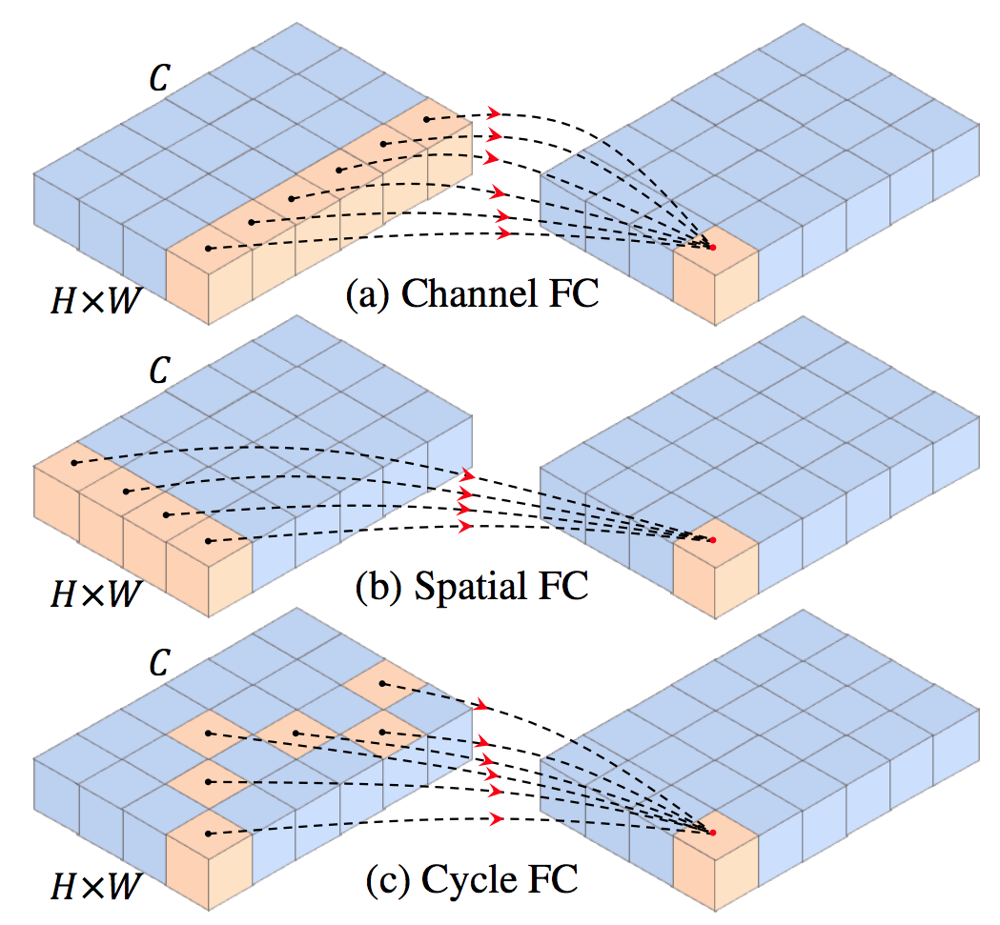
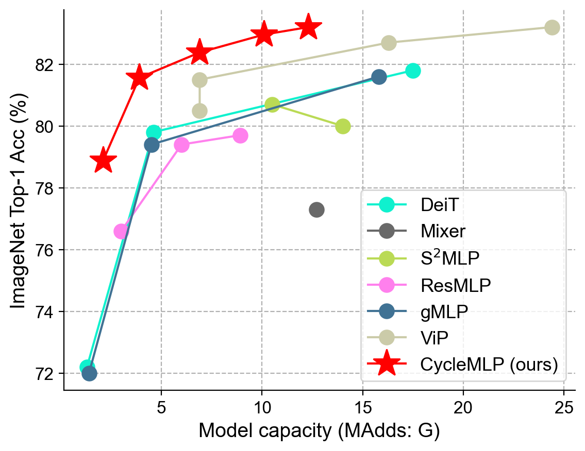

## CycleMLP: A MLP-like Architecture for Dense Prediction (ICLR 2022 Oral)

[](https://opensource.org/licenses/MIT)


<p align="middle">
  
  &nbsp;&nbsp;&nbsp;&nbsp;
  
</p>

This is a PyTorch implementation of the paper [CycleMLP: A MLP-like Architecture for Dense Prediction](https://arxiv.org/abs/2107.10224).

## Updates

- (29/01/2022) CycleMLP is accepted by ICLR 2022 as an **oral presentation**.:fire::fire::fire:
- (22/07/2021) Initial release.


## Model Zoo

We provide CycleMLP models pretrained on ImageNet 2012.

| Model                | Parameters | FLOPs    | Top 1 Acc. | Download |
| :------------------- | :--------- | :------- | :--------- | :------- |
| CycleMLP-B1          | 15M        |  2.1G    |  78.9%     |[model](https://github.com/ShoufaChen/CycleMLP/releases/download/v0.1/CycleMLP_B1.pth)|
| CycleMLP-B2          | 27M        |  3.9G    |  81.6%     |[model](https://github.com/ShoufaChen/CycleMLP/releases/download/v0.1/CycleMLP_B2.pth)|
| CycleMLP-B3          | 38M        |  6.9G    |  82.4%     |[model](https://github.com/ShoufaChen/CycleMLP/releases/download/v0.1/CycleMLP_B3.pth)|
| CycleMLP-B4          | 52M        |  10.1G   |  83.0%     |[model](https://github.com/ShoufaChen/CycleMLP/releases/download/v0.1/CycleMLP_B4.pth)|
| CycleMLP-B5          | 76M        |  12.3G   |  83.2%     |[model](https://github.com/ShoufaChen/CycleMLP/releases/download/v0.1/CycleMLP_B5.pth)|
| CycleMLP-T           | 28M        |  4.4G    |  81.3%     |[model](https://github.com/ShoufaChen/CycleMLP/releases/download/v0.1/CycleMLP_tiny.pth)|
| CycleMLP-S           | 50M        |  8.5G    |  82.9%     |[model](https://github.com/ShoufaChen/CycleMLP/releases/download/v0.1/CycleMLP_small.pth)|
| CycleMLP-B           | 88M        |  15.2G   |  83.4%     |[model](https://github.com/ShoufaChen/CycleMLP/releases/download/v0.1/CycleMLP_base.pth)|

## Usage


### Install

- PyTorch 1.7.0+ and torchvision 0.8.1+
- [timm](https://github.com/rwightman/pytorch-image-models/tree/c2ba229d995c33aaaf20e00a5686b4dc857044be):
```
pip install 'git+https://github.com/rwightman/pytorch-image-models@c2ba229d995c33aaaf20e00a5686b4dc857044be'

or

git clone https://github.com/rwightman/pytorch-image-models
cd pytorch-image-models
git checkout c2ba229d995c33aaaf20e00a5686b4dc857044be
pip install -e .
```
- fvcore (optional, for FLOPs calculation)
- mmcv, mmdetection, mmsegmentation (optional)

### Data preparation

Download and extract ImageNet train and val images from http://image-net.org/.
The directory structure is:

```
│path/to/imagenet/
├──train/
│  ├── n01440764
│  │   ├── n01440764_10026.JPEG
│  │   ├── n01440764_10027.JPEG
│  │   ├── ......
│  ├── ......
├──val/
│  ├── n01440764
│  │   ├── ILSVRC2012_val_00000293.JPEG
│  │   ├── ILSVRC2012_val_00002138.JPEG
│  │   ├── ......
│  ├── ......
```

### Evaluation
To evaluate a pre-trained CycleMLP-B5 on ImageNet val with a single GPU run:
```
python main.py --eval --model CycleMLP_B5 --resume path/to/CycleMLP_B5.pth --data-path /path/to/imagenet
```


### Training

To train CycleMLP-B5 on ImageNet on a single node with 8 gpus for 300 epochs run:
```
python -m torch.distributed.launch --nproc_per_node=8 --use_env main.py --model CycleMLP_B5 --batch-size 128 --data-path /path/to/imagenet --output_dir /path/to/save
```
### Acknowledgement
This code is based on [DeiT](https://github.com/facebookresearch/deit) and [pytorch-image-models](https://github.com/rwightman/pytorch-image-models). Thanks for their wonderful works


## Citing

```bibtex
@inproceedings{
chen2022cyclemlp,
title={Cycle{MLP}: A {MLP}-like Architecture for Dense Prediction},
author={Shoufa Chen and Enze Xie and Chongjian GE and Runjian Chen and Ding Liang and Ping Luo},
booktitle={International Conference on Learning Representations},
year={2022},
url={https://openreview.net/forum?id=NMEceG4v69Y}
}
```

## License

CycleMLP is released under MIT License.
